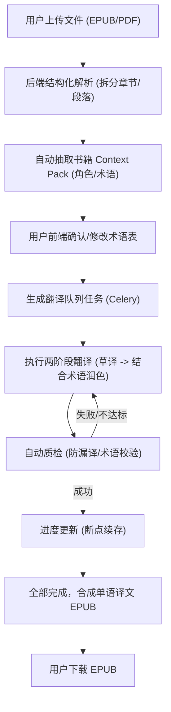

## 1. 产品概述
这是一款面向长文本（200-2000页）的专业级翻译 Web 应用，专注于科幻小说及学术文章的中英互译。
- 解决传统翻译工具在处理长篇距小说时出现的术语不一致、文风漂移、人名翻译混乱以及断点续跑困难等痛点。
- 采用先进的大模型分段翻译策略（结合书籍级 Context Pack 与两阶段翻译），保障翻译精确度极高，提供一键导出译文 EPUB 的优质体验。

## 2. 核心功能

### 2.1 用户角色
| 角色 | 注册方式 | 核心权限 |
|------|---------------------|------------------|
| 普通用户 | 邮箱/账号注册 | 上传文件，管理术语表，发起并监控翻译任务，下载翻译结果 |

### 2.2 功能模块
1. **主页/工作台**：项目列表，支持上传 PDF/EPUB 文件并创建翻译任务。
2. **任务详情页**：展示书籍章节拆分结构，实时翻译进度（按段落/章节），支持断点续跑。
3. **术语与角色管理页**：自动抽取书籍角色与专有名词，支持用户人工干预确认（默认人名音译优先）。
4. **导出模块**：支持将翻译完成的任务一键打包为高质量单语译文 EPUB 格式。

### 2.3 页面详情
| 页面名称 | 模块名称 | 功能描述 |
|-----------|-------------|---------------------|
| 主页/工作台 | 上传区域 | 支持拖拽上传 EPUB 或 PDF 文件，可勾选“开启扫描页 OCR”功能。 |
| 任务详情页 | 进度监控 | 实时展示队列中各章节/段落的翻译状态（草译/润色/完成/失败）。 |
| 术语与角色管理页 | 术语对照表 | 列表形式展示原文与译文候选，用户可批量保存确认。 |

## 3. 核心流程
用户登录系统后，上传待翻译的超长科幻小说（EPUB/PDF）。系统后台进行结构化解析，将其拆分为章节与段落。系统自动进行第一遍信息抽取，生成“术语表候选”。用户在页面上确认术语表（偏向音译统一）。随后系统将任务加入并行翻译队列，每段执行“草译+润色”两阶段翻译。完成后，用户在页面点击下载，获取纯译文 EPUB 文件。

## 4. 用户界面设计
### 4.1 设计风格
- 整体风格采用**浅色极简主义 (Light Minimalist)**，视觉体验柔和、透气，适合长文本阅读与校对时的沉浸感。
- 主色调：米白色/暖白色背景 (#F9F9F9, #FFFFFF)
- 强调色：柔和的莫兰迪色系（如雾霾蓝 #89A3B2 或 鼠尾草绿 #A9BCA3），用于进度条和核心操作按钮。
- 字体：标题使用优雅且圆润的无衬线字体（如 Quicksand 或 Nunito），正文使用阅读体验极佳的字体（如 Inter 或 Noto Sans）。
- 按钮风格：圆角设计 (border-radius: 8px或更大)，无边框或极细边框，配合轻柔的阴影效果（Soft Shadow）与淡入淡出的悬停动画。
- 布局结构：大面积留白，卡片间距宽裕，侧边栏与主内容区之间采用微妙的灰度区分或浅色分割线。

### 4.2 页面设计概览
| 页面名称 | 模块名称 | UI 元素 |
|-----------|-------------|-------------|
| 主页/工作台 | 英雄区/上传 | 极简白底卡片，带有淡灰虚线边框的拖拽上传区，图标采用柔和的单色线框风格。 |
| 任务详情页 | 进度条/列表 | 细长、平滑过渡的柔和色调进度条。章节状态 Tag 使用浅灰底色配合低饱和文字色。 |
| 术语管理页 | 数据表格 | 无边框/极简分隔线的宽敞表格，悬停时仅背景微微变浅灰，提供舒适的视觉焦点。 |

### 4.3 响应式设计
- 优先桌面端 (Desktop-first)，因为长文本处理与术语管理需要较大的屏幕空间。
- 移动端适配核心的“进度查看”与“结果下载”功能，复杂表格在移动端支持横向滚动。
