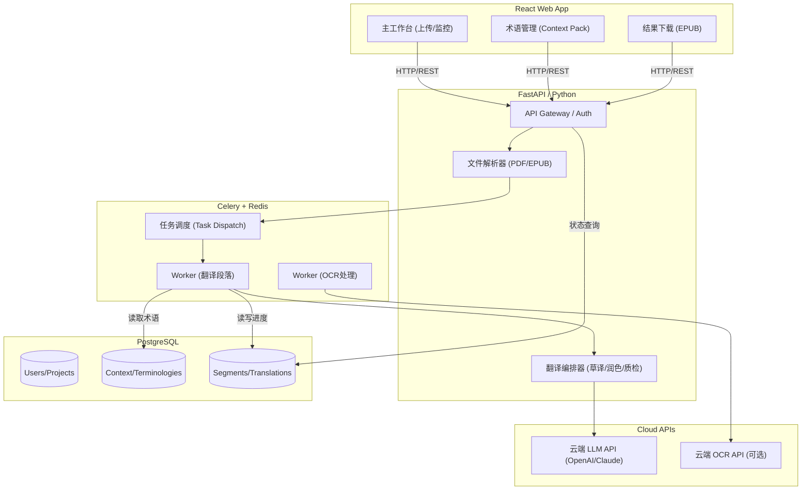
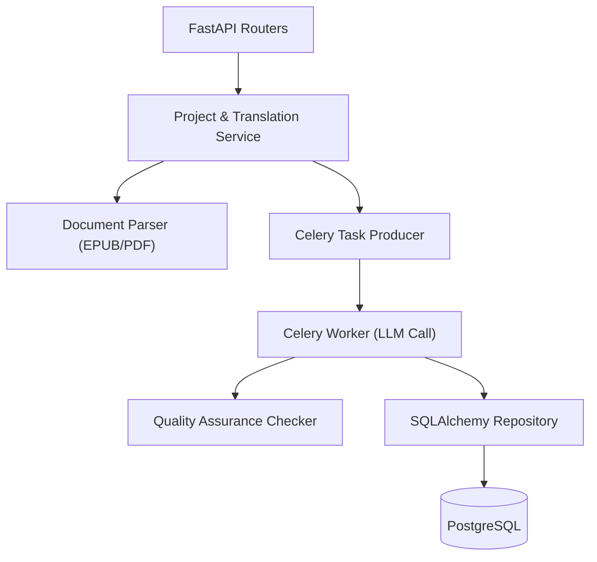
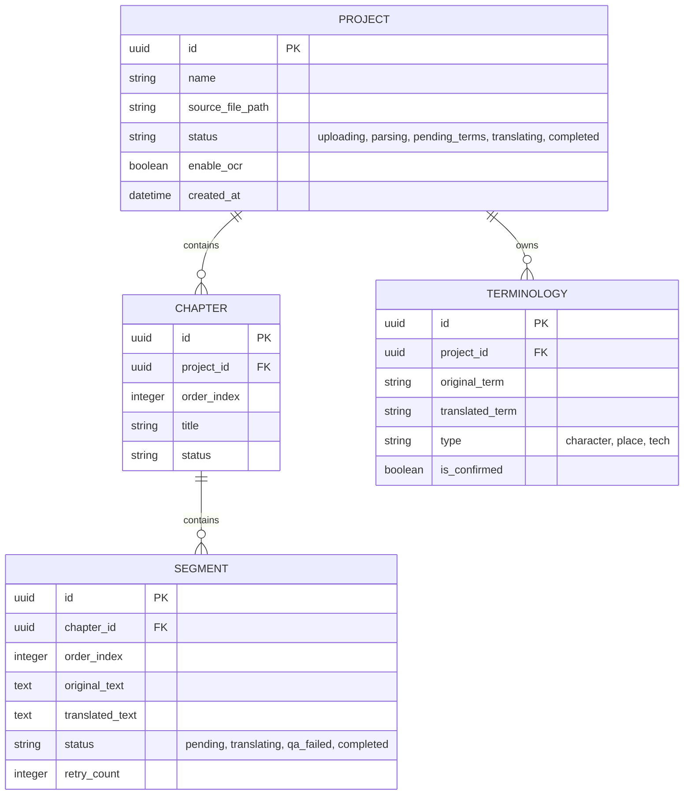

## 1. 架构设计


## 2. 技术栈说明
- **前端 (Frontend)**: React@18 + TailwindCSS@3 + Vite
- **后端 (Backend)**: Python 3.10+ / FastAPI
- **任务队列**: Celery (通过 Redis 作为 Broker/Backend)
- **数据库 (DB)**: PostgreSQL (通过 SQLAlchemy ORM 交互)
- **文件存储**: 本地挂载卷 (Volumes) 或 MinIO
- **核心依赖**: `ebooklib` (解析EPUB), `pdfplumber` / `PyMuPDF` (解析PDF), `langchain` / 原生 HTTP requests (调用大模型API)

## 3. 路由定义
| 路由 | 用途 |
|-------|---------|
| `/api/projects` | GET 获取项目列表，POST 创建翻译项目 |
| `/api/projects/{id}/upload` | POST 上传 EPUB/PDF 并触发解析任务 |
| `/api/projects/{id}/status` | GET 获取项目切分、翻译与合并进度 |
| `/api/projects/{id}/terms` | GET 获取已抽取的术语候选，POST 保存/修改术语配置 |
| `/api/projects/{id}/download` | GET 下载生成的单语译文 EPUB 文件 |
| `/api/tasks/retry` | POST 手动重试失败的段落翻译任务 (断点续跑) |

## 4. API 定义 (示例)
### 4.1 创建翻译项目
**POST `/api/projects`**
请求体 (Request):
```json
{
  "name": "三体(英文版翻译)",
  "source_lang": "en",
  "target_lang": "zh",
  "enable_ocr": false
}
```
响应体 (Response):
```json
{
  "id": "uuid-1234",
  "name": "三体(英文版翻译)",
  "status": "created",
  "created_at": "2026-04-16T10:00:00Z"
}
```

## 5. 服务器端架构图


## 6. 数据模型设计
### 6.1 数据模型定义 (ER Diagram)


### 6.2 DDL 示例
```sql
CREATE TABLE projects (
    id UUID PRIMARY KEY,
    name VARCHAR(255) NOT NULL,
    source_file_path TEXT,
    status VARCHAR(50) DEFAULT 'created',
    enable_ocr BOOLEAN DEFAULT FALSE,
    created_at TIMESTAMP DEFAULT CURRENT_TIMESTAMP
);

CREATE TABLE terminologies (
    id UUID PRIMARY KEY,
    project_id UUID REFERENCES projects(id),
    original_term VARCHAR(255) NOT NULL,
    translated_term VARCHAR(255),
    type VARCHAR(50),
    is_confirmed BOOLEAN DEFAULT FALSE
);

CREATE TABLE segments (
    id UUID PRIMARY KEY,
    chapter_id UUID, -- References Chapters
    order_index INT,
    original_text TEXT NOT NULL,
    translated_text TEXT,
    status VARCHAR(50) DEFAULT 'pending',
    retry_count INT DEFAULT 0
);
```
